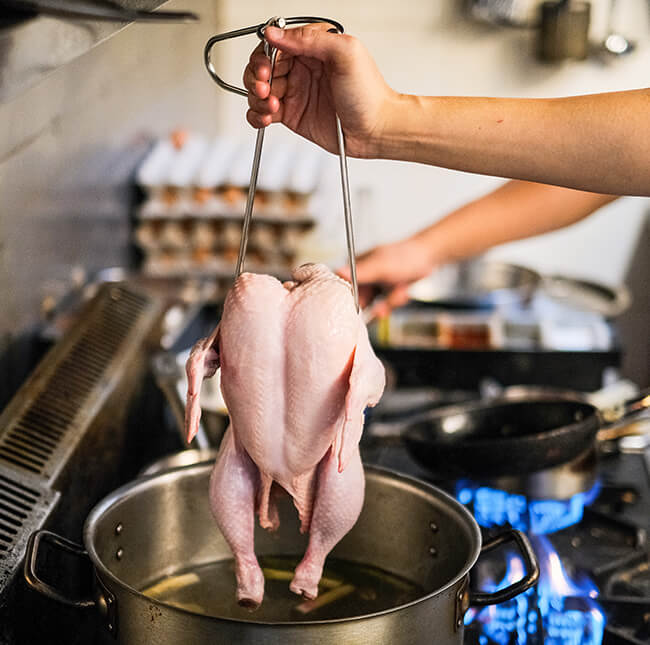
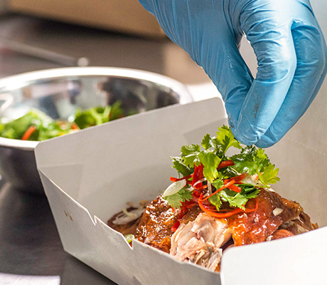

	

		

			

				

					<h1 class="fontfamily1 fontcolor1">Story</h1>
				

				

					<h4 class="font-title">Behind Every Chick,</h4>
					<h1 class="fontfamily1 fontcolor1">There Will Be A Man</h1>
				

				

					<h4 class="font-title">Meet Jeremy</h4>
				

				

					
Jeremy has always been fascinated by everything that makes a good plate of food. As a child, he would always be excited to go to his grandparents’ home to sink his teeth into a crunchy fried chicken. As he grows older, he will spend hours watching cooking shows, and experimenting in the kitchen. One day, his uncle made him a plate of poached chicken rice. Amazed by the skills required to make a simple plate of poached chicken rice, Jeremy was determined to perfect his own skills. Relentlessly trying to elevate his own recipe, he will try out different chicken rice stalls in Malaysia, and continuously improving. After years of repeating similar steps, Jeremy has found the ideal recipe for poached chicken rice.

				

			

			

				
			

		

	

	

		

			

				
			

			

				

					<h4 class="font-title">And How He Found His Chick</h4>
				

				

					
During the first Movement Control Order (MCO) in Malaysia, Jeremy was trying to find ways to mitigate financial losses for Urban Daybreak, an all-day breakfast cafe. To ensure every kitchen crew and service crew is well taken care of, he had taken the unusual route to create an entirely new brand serving poached chicken rice, and that’s how Jeremy’s Chicks was born. Sharing the same kitchen as Urban Daybreak, Jeremy’s Chicks was well-received throughout MCO with orders coming in from the only food delivery platform at that time, The Other Kitchen.

					
When MCO was lifted in Klang Valley, Jeremy and team had started searching for a new location. After finding a sweet location in Hartamas, the team created a humble cloud kitchen, and expanded its menu. Welcoming other delicious ‘chicks’ including roasted, char siu, and fried, the team had also introduced new side dishes and combo meals. To ensure every ‘chick’ is delivered to every doorstep in Klang Valley, Jeremy’s Chicks is also now available in GrabFood, foodpanda, and airasia food.

				

			
			
		

	

	

		

			

				

					<h4 class="font-title">Shakin’ The World Together</h4>
				

				

					
Jeremy’s Chicks is more than just chicken rice. Being a part of the community, Jeremy’s Chicks had started several initiatives. During the Conditional Movement Control Order (CMCO), the delivery-based chicken rice joint offered a box of free chicken rice to every food delivery partner upon every order. On a more touching note, the team behind Jeremy’s Chicks noticed that one of the chicken rice sellers in Klang Valley was financially struggling. To aid, the team had bought 100 boxes of chicken rice from the chicken rice seller, matched the same amount to be given away to a local orphanage.

				

			

			

				
			
			
		

	

